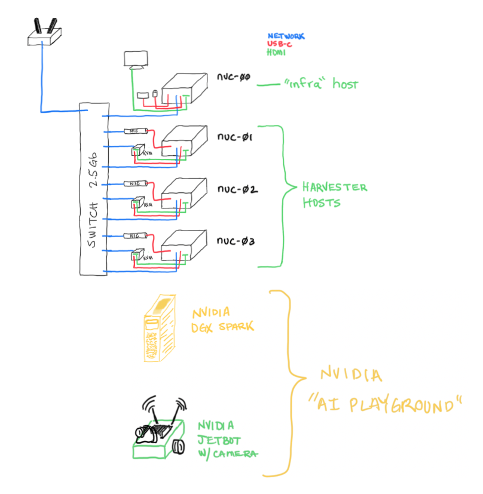

# Kubernerdes Homelab

> A self-contained Kubernetes homelab built on Intel NUCs using community Rancher/SUSE components.

This repository contains the architecture overview, scripts, and implementation steps for deploying the Rancher stack on small form-factor hardware (Intel NUCs). It is currently a collection of scripts, notes, and references — and will evolve into a more structured guide over time.

> **Note:** This is a personal lab environment designed to explore and demonstrate the platform using straightforward, repeatable methods.

**Tips before you dive in:**

* The cloud-native space moves fast. Always verify you are referencing the most current sources — a video published in June 2025 was likely recorded weeks earlier and may already be slightly dated.

## Status
**Status**: Work in Progress (April 2026) - using community images and components throughout.

Eventually this repo will be the technical steps and there will be an associated "docs" repo that provides the guidance and details of the tasks and steps provided here.  
[Documentation Repo](https://github.com/jradtke-rgs/docs.homelab.kubernerdes.com/)   
[Documentation Site - Rendered](https://jradtke-rgs.github.io/docs.homelab.kubernerdes.com/)  

## Goals

* Build a fundamental understanding of deploying Rancher — from acquisition through roll-out
* Stand up a self-sustaining network homelab consisting of:
  * Infrastructure node hosting DNS and PXE build services
  * 3-node Harvester cluster
  * Rancher Manager Server
  * SUSE Observability stack
  * SUSE Security stack (NeuVector)
  * Kubernetes cluster for running applications
  * *Bonus:* Integrated NVIDIA AI hardware with the cloud-native stack

## Day 0 — Design and Plan

**Prerequisites**

* 3 x NUCs (or similar hardware) with identical storage and network interface configurations
* 1 x admin workstation with keyboard, video, and mouse (I use a fourth NUC)
* Internet connectivity
* [Hardware Overview](./Hardware.md)

## Day 1 — Build

1. Build the **Admin Host** (`nuc-00` — physical node)
2. Build the **Infra Nodes** (`nuc-00-01` / `nuc-00-02` — VMs for DNS and PXE services)
3. Install and configure **Hauler** on the Admin Host
   - Pull Harvester, Rancher, and related artifacts
4. Build the **Harvester Cluster** (via USB or PXE)
5. Deploy 3 Linux VMs to host **Rancher Manager Server** (RMS)
6. Install K3s/RKE2 on the VMs, then deploy Rancher Manager Server

## Day 2 — Operate

- Deploy a K8s cluster (`observability`) via RMS, then install **SUSE Observability**
- Connect clusters to the Observability stack
- Deploy a K8s cluster (`applications`) via RMS using SL-Micro + RKE2
- Install **SUSE Security** (NeuVector) on the `applications` cluster
- Deploy test app to demonstrate **SUSE Security** capability of monitor vs protect mode
- Enable monitoring, explore Grafana dashboards
- Integrate with external systems and configure RBAC [TBD]
- Deploy updates via Fleet [TBD]

---

## Environment Overview

The admin host (`nuc-00`) connects to the Internet to pull down the required software and this repository. Once all artifacts have been acquired, the Internet link can be disconnected — the entire environment can be built and managed without external connectivity.

See the full [Hardware Inventory and Description](./Hardware.md).

## TODO

While this repo is available via HTTP/S, I will make all the content available or sourced from a USB device, and then shared from the nuc-00, to emulate an airgap deploy.

---

## Links

### Guides

- [Hauler — Product Page](https://ranchergovernment.com/products/hauler)
- [Hauler — Documentation](https://docs.hauler.dev/docs/intro)
- [Deploy Rancher Manager — Helm CLI Quick Start](https://ranchermanager.docs.rancher.com/getting-started/quick-start-guides/deploy-rancher-manager/helm-cli)
- [Virtualization on Kubernetes with Harvester](https://ranchermanager.docs.rancher.com/integrations-in-rancher/harvester)

### References

- [Harvester Community Images (GitHub Releases)](https://github.com/harvester/harvester/releases)
- [Harvester Intro and Setup — includes VM deployment](https://www.suse.com/c/rancher_blog/harvester-intro-and-setup/)

### Videos, Blogs, and Walkthroughs

- [Harvester + Kasm — GPU Passthrough (YouTube)](https://www.youtube.com/watch?v=3tMfc0fUvk4)
- [Three Easy-Mode Ways of Installing Rancher onto Harvester](https://ranchergovernment.com/blog/three-easy-mode-ways-of-installing-rancher-onto-harvester)

